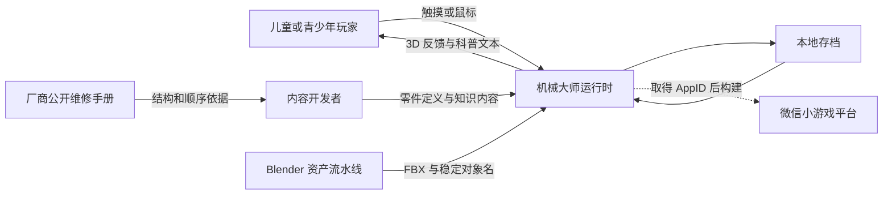
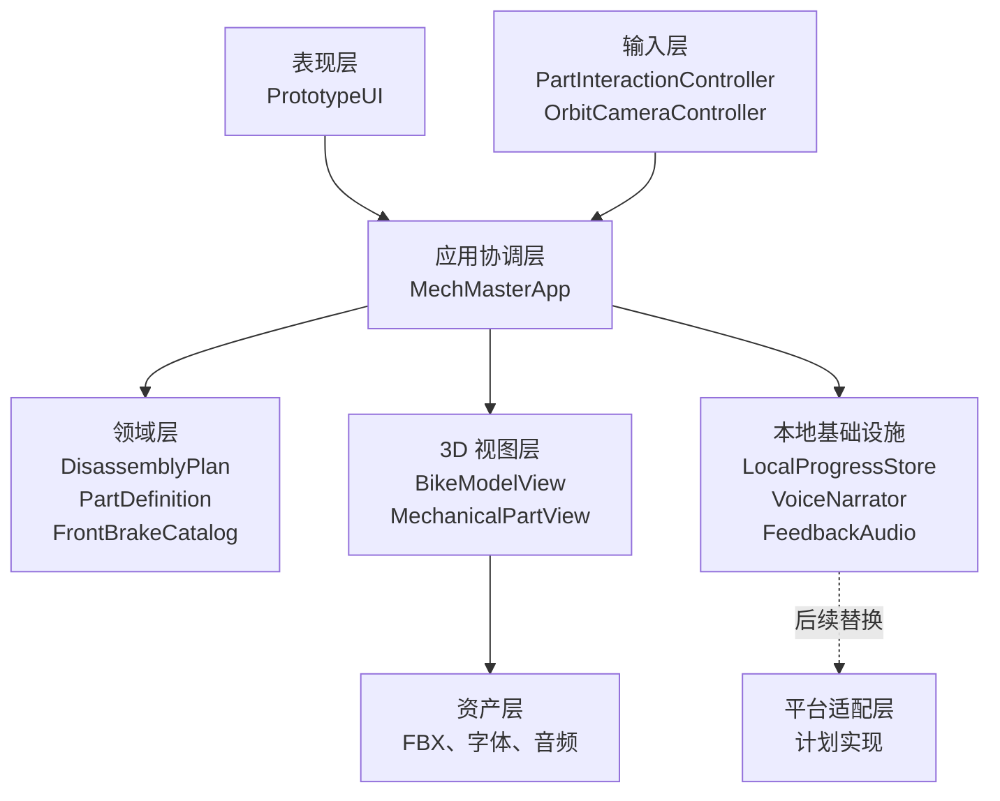
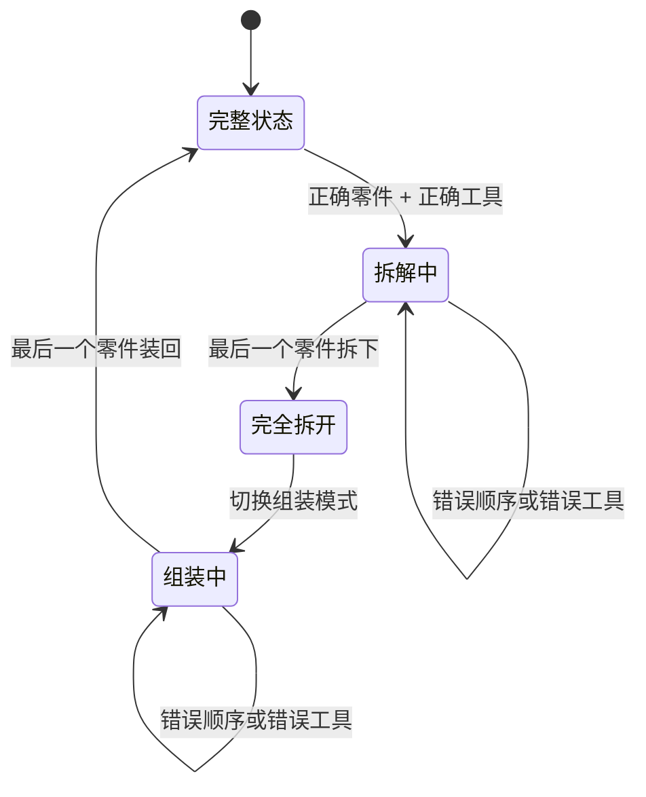
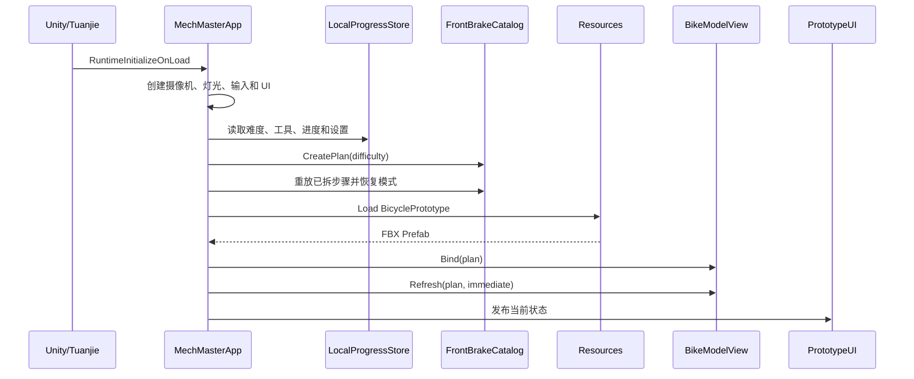
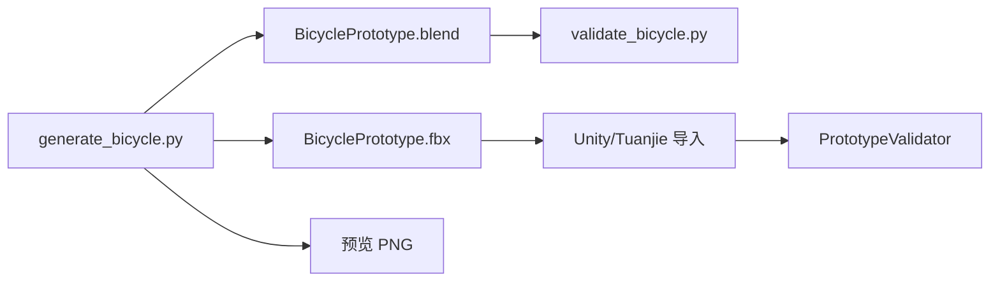

# 机械大师：架构说明

本文描述首版自行车拆装样片的当前实现、边界和演进方向。文档中的“当前”表示仓库里已经存在的代码，“计划”表示取得微信小游戏 AppID、安装完整团结引擎编辑器或进入多机械量产阶段后再实现的内容。

## 1. 架构目标

架构优先保证以下能力：

1. 拆装规则可以脱离引擎测试。
2. 同一个真实零件模型可以按难度组合成不同操作粒度。
3. 拆解与组装共用一套状态，不维护两份易失配的流程。
4. 3D 对象名、逻辑 ID 和科普内容之间有稳定映射。
5. 首版能离线运行，平台能力通过适配边界逐步接入。
6. 后续增加汽车、摩托车等模块时不重写核心状态机。

不以首版为目标的能力包括联网账号、排行榜、商业化激励、专业扭矩训练和实时多人协作。

## 2. 系统上下文



首版运行时不依赖网络服务。微信平台还不是领域规则的一部分。

## 3. 总体分层



依赖方向以领域层为中心。`MechMaster.Domain` 不引用 Unity、微信 SDK 或文件系统。

## 4. 代码与目录映射

| 目录 | 职责 | 运行环境 |
| --- | --- | --- |
| `Assets/Scripts/Domain` | 拆装顺序、难度、工具、零件知识 | 纯 C# |
| `Assets/Scripts/Runtime` | 应用入口、3D、输入、存档、音频 | Unity/Tuanjie Runtime |
| `Assets/Scripts/Runtime/UI` | 首版程序化界面 | Unity/Tuanjie Runtime |
| `Assets/Scripts/Editor` | 资产和目录校验 | Editor Only |
| `Assets/Art/Models/Source` | Blender 主源文件 | Blender |
| `Assets/Resources` | 首版运行时加载资源 | Unity/Tuanjie Runtime |
| `Tools/Blender` | 可重复生成和验证模型 | Blender Python |
| `Tools/Tests` | 无引擎领域测试 | .NET 8 |
| `Docs` | 产品、架构、开发和来源记录 | 文档 |

程序集边界：

- `MechMaster.Domain.asmdef`：禁用引擎引用。
- `MechMaster.Runtime.asmdef`：只引用 Domain。
- `MechMaster.Editor.asmdef`：只在 Editor 平台编译，引用 Domain 和 Runtime。

## 5. 领域层

### 5.1 类型职责

| 类型 | 职责 |
| --- | --- |
| `DifficultyLevel` | `Simple`、`Standard`、`Advanced` 三档粒度 |
| `AssemblyMode` | 拆解或组装 |
| `ToolKind` | 手、内六角扳手、梅花扳手 |
| `PartDefinition` | 稳定 ID、名称、工具和三层知识文本 |
| `DisassemblyPlan` | 有序步骤、已拆集合、顺序和工具校验 |
| `OperationResult` | 成功或结构化失败及用户提示 |
| `FrontBrakeCatalog` | 当前前刹车模块的三档内容工厂 |

### 5.2 状态不变量

`DisassemblyPlan` 必须始终满足：

- 至少有一个步骤。
- 同一计划中的零件 ID 唯一且区分大小写。
- 拆解只能处理第一个尚未拆下的步骤。
- 组装只能处理最后一个仍处于拆下状态的步骤。
- 错误顺序和错误工具都不改变状态。
- `RemovedCount == 0` 表示完整组装状态。
- `RemovedCount == Steps.Count` 表示完整拆解状态。

### 5.3 拆装状态机



组装不是独立步骤表，而是同一个 `Steps` 列表的严格倒序。这让新增和修订拆解步骤时不会忘记同步组装流程。

### 5.4 难度不是数值倍率

三档难度分别创建独立的 `PartDefinition` 序列，不使用“步骤数乘倍率”。原因是每档需要改变的是语义单元：

- 启蒙模式把卡钳、来令片、固定件视为“前刹车总成”。
- 探索模式把来令片和弹簧作为一组。
- 进阶模式把保险卡、固定销、弹簧、左右来令片分别操作。

知识文本也按难度逐层叠加，而不是简单改变字体或提示次数。

## 6. 应用协调层

`MechMasterApp` 是当前组合根，负责创建和连接领域对象、模型视图、输入、摄像机、UI、音频与存档。

它不应该包含具体零件几何知识；当前模型映射位于 `BikeModelView`。进入第二个正式机械模块前，需要进一步抽象模块注册和加载接口。

### 6.1 启动顺序



运行入口通过 `RuntimeInitializeOnLoadMethod` 创建，因此场景不需要手工绑定脚本引用。

### 6.2 操作请求顺序

一次拖动操作经过以下路径：

1. `PartInteractionController` 射线检测 `MechanicalPartView`。
2. 按下时调用 `SelectPart`，更新科普面板。
3. 拖动距离达到阈值且手指松开时调用 `Operate(partId)`。
4. `DisassemblyPlan.TryOperate` 校验零件、顺序和工具。
5. 成功时 `BikeModelView.Refresh` 播放爆炸或归位动画。
6. `FeedbackAudio` 和 `VoiceNarrator` 提供反馈。
7. `LocalProgressStore` 写入新状态。
8. UI 通过 `StateChanged` 事件重新绘制。

## 7. 输入与摄像机

### 7.1 输入所有权

输入冲突按以下优先级处理：

1. UI 面板。
2. 已命中的机械零件。
3. 空白区域镜头操作。

`PartInteractionController.IsDraggingPart` 用于在零件操作期间暂时禁止镜头旋转。

### 7.2 手势映射

| 输入 | 行为 |
| --- | --- |
| 轻点零件 | 选择并显示知识，不更改状态 |
| 拖动零件后松手 | 尝试拆下或装回 |
| 单指拖动空白 | 旋转镜头 |
| 双指缩放 | 改变镜头距离 |
| 鼠标右键拖动 | 桌面端旋转 |
| 鼠标滚轮 | 桌面端缩放 |

触摸阈值用屏幕像素表达，真机阶段应按 DPI 和儿童手势测试调整。

## 8. 3D 模型与逻辑绑定

### 8.1 单位和坐标

Blender 场景使用公制，`1 Blender Unit = 1 m`。当前模型基准：

| 指标 | 数值 |
| --- | ---: |
| 轴距 | 1.120 m |
| 轮胎外径 | 0.698 m |
| 前碟片直径 | 0.180 m |
| 网格对象数 | 40 |
| 顶点数 | 8,256 |
| 多边形数 | 7,274 |

FBX 以 `-Z Forward / Y Up` 导出，引擎中保持 1:1 比例。自由缩放由摄像机距离实现，不修改模型物理尺度。

### 8.2 稳定对象名

逻辑代码不依赖 Blender 自动生成的 `Cube.001`，而依赖人工约定的稳定名称，例如：

- `Front_ThruAxle`
- `Front_Tire`
- `Front_Rim`
- `Front_Spokes`
- `Front_Hub`
- `Front_EndCaps`
- `Front_Caliper`
- `LeftPad` / `RightPad`
- `PadSpring` / `PadPin` / `RetainingClip`
- `Front_Rotor` / `RotorBolts`

重命名这些对象属于接口变更，必须同步模型映射和验证器。

### 8.3 难度绑定

一个逻辑零件可绑定多个网格。例如启蒙模式的 `front_brake_assembly` 同时控制卡钳、来令片、弹簧、固定销、保险卡、安装螺栓和油管。

同一网格在不同难度下可以属于不同逻辑单元，但同一个计划内不应被两个可操作单元重复控制。

### 8.4 视图状态

`MechanicalPartView` 保存每个受控 Transform 的初始局部位置。拆下时沿预计算方向移动形成爆炸图；装回时插值到原位。

首版不启用刚体物理模拟，原因是确定性的教育流程比自由掉落更重要，也能降低微信小游戏端的性能和交互不确定性。

## 9. UI 架构

当前 UI 由 `PrototypeUI.OnGUI` 程序化绘制，优点是仓库恢复后无需依赖 Prefab GUID 就能运行。布局包括：

- 顶部品牌和模块标题。
- 左侧难度、工具、模式、重置和讲解控制。
- 右侧零件知识与下一步提示。
- 底部状态反馈。

程序化 UI 适合样片，不适合长期内容生产。进入美术和多分辨率适配阶段后应迁移到 UGUI 或 UI Toolkit Prefab，并保持调用的应用层命令不变。

## 10. 存档

### 10.1 当前实现

`LocalProgressStore` 使用 `PlayerPrefs`，键统一以 `mech_master.v1.` 开头，保存：

- 当前难度。
- 当前工具。
- 讲解开关。
- 每档难度的 `RemovedCount`。
- 每档难度的 `AssemblyMode`。

恢复时先创建全新计划，再按顺序重放前 N 个拆解操作。因为状态机保证已拆集合始终是步骤前缀，所以不需要序列化零件数组。

组装中状态也可以用剩余的前缀数量表达：完整拆解后按倒序移除集合元素，集合仍是原步骤列表的前缀。

### 10.2 演进要求

正式微信版本应抽取：

```csharp
public interface IProgressStore
{
    ProgressSnapshot Load(string moduleId, DifficultyLevel difficulty);
    void Save(ProgressSnapshot snapshot);
}
```

本地与微信实现必须共享版本化数据结构，并提供损坏数据回退、schema 迁移和容量限制处理。

## 11. 音频

### 11.1 当前实现

`FeedbackAudio` 在运行时生成短促的成功和错误音，不依赖外部音频文件。`VoiceNarrator` 保留统一入口，当前只输出带前缀的开发日志。

这样可以验证调用链，同时避免在未完成许可审查前引入来源不明的素材。

### 11.2 许可要求

预录语音和音效接入前必须登记作者、来源、许可证、下载日期和修改方式。具体规则见音频目录说明。

## 12. 3D 资产流水线



### 12.1 生成阶段

生成脚本负责：

- 清空 Blender 场景。
- 用真实米制尺寸创建自行车和前刹车细节。
- 创建写实但轻量的材质。
- 设置三点灯光和预览相机。
- 保存 `.blend` 主源、导出 FBX 并渲染预览图。

生成脚本是可重复的，不能手工编辑 FBX 后丢失来源。

### 12.2 Blender 验证

`validate_bicycle.py` 检查：

- 必需对象名。
- 轴距范围 1.08–1.16 m。
- 27.5 英寸轮径范围 0.69–0.71 m。
- 180 mm 碟片误差不超过 3 mm。
- 前辐条组具有足够多的面。
- 网格、顶点和多边形统计。

### 12.3 Unity/Tuanjie 验证

`PrototypeValidator` 在导入后检查 FBX 是否存在、稳定对象名是否完整，以及三档计划是否为 4/8/12 步。

Blender 校验和引擎校验解决不同问题，两者都必须执行。

## 13. 资源加载策略

当前 `MechMasterApp` 通过 `Resources.Load<GameObject>("BicyclePrototype")` 加载样片模型，优点是实现简单、离线可运行。

`Resources` 不适合作为量产目录，因为其中资源会统一进入构建且难以精细分包。进入多机械阶段后计划改为：

1. 启动包保留 UI、配置和首个轻量模块。
2. 每台机械使用独立资源包。
3. 微信分包或远程下载负责按需获取。
4. 资源缓存层处理版本、校验和失败重试。
5. 领域目录只持有逻辑资源键，不持有平台路径。

## 14. 微信小游戏适配边界

### 14.1 当前状态

- 项目按微信小游戏立项。
- 尚未取得 AppID。
- 当前机器未安装完整团结引擎 Editor 和微信构建模块。
- 尚未进行微信开发者工具模拟器或真机测试。

因此不能声称微信构建、包体和性能已经通过。

### 14.2 计划中的平台接口

```csharp
public interface IPlatformStorage
{
    string Read(string key);
    void Write(string key, string value);
}

public interface IPlatformAudio
{
    void PlayNarration(string clipId);
}

public interface IModelProvider
{
    void Load(string moduleId, Action<GameObject> completed);
}
```

具体接口签名可在接入 SDK 时调整，但依赖方向不可反转：微信 SDK 实现接口，领域层不知道微信类型。

平台层还需要覆盖：

- 生命周期和前后台切换。
- 本地文件与缓存配额。
- 分包和远程资源失败处理。
- 音频解锁、暂停与恢复。
- 安全区、横竖屏和触摸差异。
- 隐私授权与儿童保护要求。

## 15. 性能策略

### 15.1 目标

首版策略是轻量、确定、可测，而不是追求桌面级材质效果。

### 15.2 当前措施

- 40 个网格对象，约 8.3k 顶点。
- 重复辐条在 Blender 中合并为一个网格对象。
- 无骨骼动画和蒙皮。
- 拆装使用 Transform 插值，不使用刚体模拟。
- 材质数量受控，无高成本透明材质。
- 射线检测只在按下时执行。
- 领域状态不在每帧分配集合。

### 15.3 真机阶段必须测量

- 初始包、分包和下载资源大小。
- 首次进入和二次进入耗时。
- 峰值内存。
- 中低端设备帧率、发热和耗电。
- Draw Call、SetPass、纹理显存和 Shader 变体。
- 高频触摸下的 GC Alloc。
- 切换多个模块后的资源释放。

只有取得真机数据后才能确定最终预算。

## 16. 隐私与儿童安全

首版不需要账号、位置、相册、通讯录、麦克风和行为画像。除平台强制信息外，不主动收集个人信息。

产品内容必须明确：

- 这是科普模拟，不是实际维修认证。
- 制动系统属于安全关键部件。
- 真实拆装由监护人或专业技师指导。
- 刚使用后的碟片可能高温。
- 刹车油和污染物相关模拟不鼓励儿童自行操作真车。

## 17. 测试架构

| 层级 | 当前工具 | 覆盖内容 |
| --- | --- | --- |
| 领域单元测试 | .NET 8 控制台 | 步骤数、顺序、工具、完成状态、知识分层 |
| 资产结构测试 | Blender Python | 名称、尺寸、几何统计 |
| 导入检查 | Unity Editor Menu/CLI | FBX 对象名与目录定义 |
| 交互测试 | Play Mode 手工测试 | 触摸、镜头、拖动、UI、存档 |
| 平台测试 | 计划：微信开发者工具与真机 | 包体、性能、生命周期、音频和缓存 |

当前领域测试不依赖 NUnit，便于没有编辑器时先验证业务规则。取得稳定编辑器环境后，可再增加 PlayMode/EditMode 自动化测试。

## 18. 添加新机械模块

建议的目标接口：

```csharp
public interface IMechanicalModule
{
    string Id { get; }
    string DisplayName { get; }
    DisassemblyPlan CreatePlan(DifficultyLevel difficulty);
    IReadOnlyDictionary<string, string[]> CreateModelBindings(
        DifficultyLevel difficulty);
}
```

新增模块流程：

1. 明确模块范围和儿童知识目标。
2. 收集公开维修资料并登记来源。
3. 用真实单位制作模型和稳定对象名。
4. 定义三档拆装粒度。
5. 为每个零件填写分层知识。
6. 添加领域、Blender 和导入测试。
7. 配置资源包和模块入口。
8. 在目标设备完成性能与可用性测试。

对于“先组装小部件、再装成整机”的需求，计划用父子计划或装配子系统表达，例如：

- 变速器子计划完成后生成“变速器总成”。
- 避震子计划完成后生成“前叉总成”。
- 整车计划依赖这些总成，而不重复所有内部步骤。

## 19. 当前技术债务

1. UI 使用 IMGUI，尚未做正式 Prefab 和设计系统。
2. `BikeModelView` 仍硬编码自行车对象映射。
3. `MechMasterApp` 同时承担组合、流程和部分场景创建职责。
4. `Resources` 加载不适合多模块和微信分包。
5. 讲解音频尚未接入真实音频资产。
6. 爆炸方向由步骤索引生成，尚未使用美术标注锚点。
7. 目前使用 BoxCollider 自动点选，细小零件需要真机调整热区。
8. 尚未验证团结引擎编译和微信导出。
9. 本地存档没有 schema 迁移和损坏数据诊断。
10. 没有内容管理后台或本地化工作流。

这些问题不阻止验证核心玩法，但进入生产前必须按优先级处理。

## 20. 架构决策摘要

| 决策 | 选择 | 原因 |
| --- | --- | --- |
| 引擎语言 | C# | 团结引擎/Unity 原生脚本生态 |
| 领域层 | 纯 C# | 可脱离引擎快速测试 |
| 3D 单位 | 米制 1:1 | 保持机械比例可信 |
| 难度 | 独立步骤目录 | 体现真实语义粒度，而非数值倍率 |
| 组装顺序 | 拆解严格倒序 | 单一事实来源，避免流程漂移 |
| 拆出表现 | 确定性爆炸图 | 易理解、低性能成本、便于恢复 |
| 首版存档 | PlayerPrefs | 离线、简单，符合当前范围 |
| 首版资源 | Resources | 快速验证；量产时替换 |
| 3D 生成 | Blender Python | 可重复、可校验、易审查尺寸 |
| 微信集成 | 适配层 | 防止平台 API 污染规则和内容 |

## 21. 完成定义

一个机械模块只有同时满足以下条件才算完成：

- 结构与顺序有公开资料依据。
- 模型使用真实单位并通过尺寸验证。
- 所有可操作零件具有稳定逻辑 ID 和对象映射。
- 三档难度都能完整拆解并倒序组装。
- 错误顺序和错误工具不会推进状态。
- 科普文本适合对应年龄且包含安全边界。
- 领域测试、资产测试和导入测试通过。
- 新资产来源和许可证已记录。
- 在目标微信设备上满足最终确定的包体、内存和帧率预算。

## 22. 相关文档

- [项目说明](../README.md)
- [产品规格](PRODUCT_SPEC.md)
- [开发与验证](DEVELOPMENT.md)
- [资料来源](References/SOURCES.md)
- [音频资产规范](../Assets/Audio/README.md)

