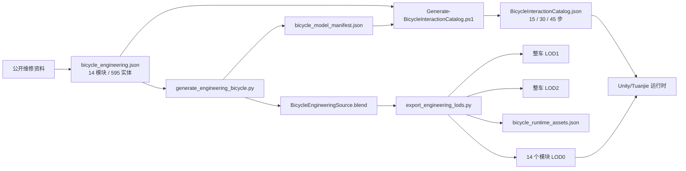
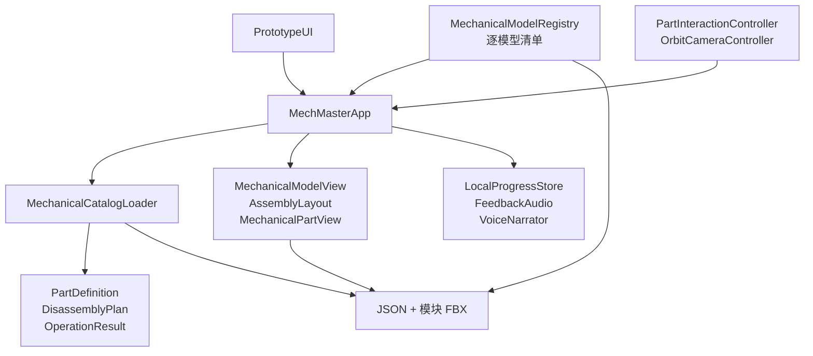
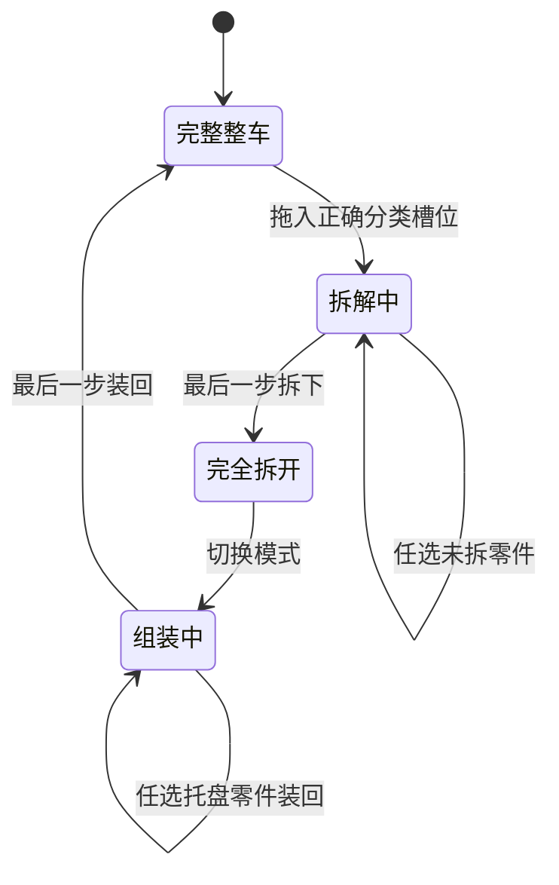

# 机械大师：系统架构

本文描述通用机械模型运行时，以及当前已交付的 27.5 英寸 2×10 工程自行车。自行车此前已通过本机团结引擎 Editor 的编译与 Play Mode 验证；通用模型改造已通过目录、导入和批处理 Play Mode 启动校验，手势与画面仍需人工复核。微信小游戏 AppID、微信开发者工具与真机测试仍属于后续工作。

## 1. 架构目标

1. 机械尺寸、零件身份、模型对象和交互步骤使用可校验的单一数据链。
2. 同一台车能按总成、同类零件组、单个实体呈现三种拆解等级。
3. 拆解与组装共用一套状态，玩家可自由选择尚未操作的零件。
4. 领域规则不依赖 Unity/Tuanjie 或微信 API，可由 .NET 直接测试。
5. 高精度源模型与微信运行 LOD 分离，增加细节不直接拖累运行端。
6. 新增合格机械模型只增加模型清单、交互目录和资源，不修改主程序。

## 2. 数据与资产主链

手工修改生成后的 FBX 或交互目录会在下一次生成时被覆盖。修改应进入 BOM 或生成脚本。

## 3. 运行时分层

### 3.1 领域层

`Assets/Scripts/Domain` 不引用 Unity。核心不变量：

- 计划至少包含一个步骤，步骤 ID 在计划内唯一。
- 拆解可处理任意尚未拆下的步骤。
- 组装可处理任意仍处于拆下状态的步骤。
- 重复操作不改变状态；工具信息不参与操作校验。
- `RemovedCount == Steps.Count` 表示完全拆开。
- `RemovedCount == 0` 表示完整组装。

`PartDefinition` 除名称、工具和三层科普文本外，还携带 `AssemblyId`、`ComponentId` 和模型对象名集合。旧的前刹车目录仍可作为小型领域样例使用，但正式启动流程读取整车目录。

### 3.2 三档粒度

| 拆解等级 | 生成规则 | 步骤数 | 一个步骤绑定 |
| --- | --- | ---: | --- |
| Simple（简单） | 主要机械模块 | 15 | 大型总成内全部实体 |
| Standard（进阶） | 模块内按功能系统分组 | 30 | 多类关联实体集合 |
| Advanced（探索） | 更细的机械子总成 | 45 | 小型关联实体集合 |

三档计划都完整且无重复地绑定 595 个模型对象。生成器按 BOM 中相邻、相关的组件合并机械单元；即使在探索等级，辐条、链节、紧固件和内部小件也不会逐个操作。

组装不维护第二份清单，而是直接操作同一个已拆零件集合。拆解与组装都不限制顺序，BOM 增减零件时也不会产生两份清单漂移。

### 3.3 应用协调

`MechMasterApp` 是当前组合根：

1. 自动发现 `Resources/MechanicalCatalog/Models` 中的模型清单，读取所选模型、等级、进度和讲解设置。
2. 通过 `MechanicalCatalogLoader` 加载该模型自己的三级交互目录。
3. 从清单列出的 `Resources` 路径实例化分件模块；当前自行车为 14 个 LOD0。
4. 由 `MechanicalModelView` 将步骤绑定到 FBX/Prefab 对象，`AssemblyLayout` 根据模型尺寸布置 3D 收纳区。
5. 恢复准确的已拆零件 ID 集合并刷新分类托盘位置。
6. 接收 UI 和输入命令，保存新状态。

当前原型为验证 595 实体交互会一次装载全部 LOD0。微信量产版本应先显示整车 LOD1，只在进入某个模块时替换成该模块 LOD0，并在退出时释放。

## 4. 交互绑定

模型源对象同时具有：

- Blender 对象名，例如 `MM_wheel_front_spoke_01`。
- 稳定逻辑 ID，例如 `bike.wheel_front.spoke.01`。
- 装配 ID、维修边界和 LOD 元数据。

生成器把逻辑 ID 与对象名写入 `bicycle_model_manifest.json`；内容生成器再把所需对象名写进每个 `PartDefinition` 对应的 JSON 步骤。运行时不猜测 Blender 自动名称。

`MechanicalModelView` 为每个计划步骤建立一个 `MechanicalPartView`。若一个步骤控制多个对象，所有对象都通过 `MechanicalPartHitProxy` 指向同一个视图；因此点击一根辐条或一个总成中的任一可见实体，都能找到正确的逻辑步骤。

运行时为各零件网格建立独立 `MeshCollider`，避免车架等中空结构被包围盒误选；几何表面接近时优先选择较小的精确目标。真机阶段需要按模块启用并评估简化碰撞网格的性能。

`PartInteractionController` 统一分配观察和拆装手势：默认观察模式下拖动车身也只旋转，轻点才选中；切换“拆装零件”后拖动模型操作零件，空白处和桌面右键仍用于旋转。鼠标使用逐事件坐标，触摸使用同一状态机，第二根手指加入或触摸被取消时不提交拆装。

`OrbitCameraController.Pan` 以设计像素保存平移，叠加到投影矩阵的光心偏移，不修改轨道中心和自动构图距离；屏幕上的上下左右不随旋转改变。四向按钮与其输入屏蔽区域均来自 `WorkshopLayout.PanControls`。取消平移保留角度和缩放，整机/收纳取景则一并复位。回归验证包含平移方向、距离、射线命中一致性、边界和复位。

`WorkshopLayout` 统一提供面板绘制、命中排除、底部分类槽和相机可用区域。`OrbitCameraController` 根据模型包围盒角点与可用区域调整取景中心和距离，保持 1:1 模型尺度不变；整车视图和收纳视图分开，左右面板可折叠。

爆炸视图复用当前拆解等级的 `MechanicalPartView` 逻辑单元，不直接操作 595 个原始实体。`MechanicalModelView` 按清单中的总成计算径向、切向和高度偏移，并按模型尺寸缩放；局部模式只设置一个逻辑单元的观察偏移。`OrbitCameraController` 根据偏移后的包围盒重新构图，同时保留当前观察角度。爆炸偏移与拆装托盘偏移在 `MechanicalPartView` 中独立叠加，因此观察状态不会污染拆装状态。

中文讲解在 Windows Editor 中由 `VoiceNarrator` 调用本地 `WindowsSpeechHost`，使用已安装的系统中文语音。`LocalSpeechBuilder` 从仓库源码编译辅助程序到 `Library`。切换零件会取消旧播报；正常取消不能当成音频故障。此适配不进入微信构建，微信语音与音频资源仍需单独接入。

## 5. 拆装状态与表现

`MechanicalPartView` 保存每个目标 Transform 的初始局部位置，并用确定性插值移动到所属模块的分类托盘。没有启用刚体自由掉落，因为儿童科普需要稳定、可恢复的关系展示，微信端也能避免额外物理开销。

`ExplosionViewMode` 仅存在于运行时应用协调层，取值为 `None / Global / Local`。它不进入 `LocalProgressStore`；执行拆装、整机归位、查看收纳、重建计划或切换等级时都会显式清除，保证存档仍只描述真实拆装进度。

当前自行车托盘按 14 个模块分区；其他模型按各自清单生成分类，同一模块内部使用稳定槽位索引，分类超过 14 个时界面分页。正式美术阶段仍应在源模型中增加模块级拆装轴与停靠点。

## 6. 3D 资产架构

### 6.1 Source

- `BicycleEngineeringSource.blend`
- 595 个有稳定 ID 的零件对象，其中 585 个网格对象。
- 119,306 顶点，111,694 面。
- 保留齿形、胎纹、紧固件、密封、活塞、轴承、弹簧和重复件。
- 用于特写、教学渲染和派生运行资产，不直接在微信端整体加载。

### 6.2 LOD0

- 每个装配模块一个 FBX，共 14 个。
- 保留该模块所有独立交互对象和 Source 级局部结构。
- 预期按当前学习模块加载；原型为全量交互暂时一起装载。

### 6.3 LOD1

- 整车观察模型。
- 过滤内部密封、轴承、活塞等不可见细节。
- 每个模块合并为一个对象，共 14 个对象、71,305 面。

### 6.4 LOD2

- 菜单缩略图或远景。
- 过滤细小重复件并合并整车。
- 1 个对象、26,671 面。

FBX 使用 `-Z Forward / Y Up`，引擎中 `1 unit = 1 m`。自由缩放通过摄像机距离完成，不改变机械物理尺度。

## 7. 尺寸与模块边界

自动验证锁定：

- 轮外径 698 mm、轴距 1120 mm。
- 前后花鼓开档 110 / 148 mm。
- 前后碟片约 180 / 160 mm。
- 前后各 32 根辐条。
- 10 片飞轮、2 片牙盘、110 节链条。
- 前后制动各展开为 37 个实体单元。

焊接、粘接、硫化和铆死结构是制造边界；链条以快拆扣作为拆装边界；密封轴承作为维修单元。详细约定见 `ENGINEERING_BOM.md`。

## 8. 内容生成

`Generate-BicycleInteractionCatalog.ps1` 同时读取 BOM 和模型清单：

- 展开后刹车继承前刹车的 37 个零件定义。
- 按安全的整车拆解模块顺序生成三档计划。
- BOM 可保留真实工具类别作为科普元数据，但运行时不要求选择或匹配工具。
- 根据零件类型生成儿童可读的基础作用、进阶原理和探索边界。
- 校验每个物理实体都存在模型对象。

当前知识文本由规则生成，保证覆盖完整；进入正式内容制作时应由自行车维修人员和儿童教育编辑逐条审校，而不是把规则生成文本视为最终出版稿。

## 9. 本地存档

`LocalProgressStore` 使用 `PlayerPrefs`，保存当前模型、拆解等级、讲解开关，以及按「模型 ID + 等级」区分的精确已拆步骤集合与模式。恢复时重建计划并重放仍然存在的步骤 ID；旧自行车存档可读取并在下次保存时写入新键。

已拆集合不是固定前缀，因为允许自由顺序拆装，所以必须保存步骤 ID 而不只保存数量。正式微信版本应抽象 `IProgressStore`，加入 schema 版本、损坏回退和微信存储容量处理。

## 10. 验证体系

| 层级 | 工具 | 当前覆盖 |
| --- | --- | --- |
| 领域与目录 | .NET 8 | 状态机、BOM、595 实体数量、三档计数、模型清单自动发现与路径校验 |
| 源模型 | Blender Python | 唯一 ID、模块数量、尺寸、几何统计 |
| 运行资产 | Blender Python | 14 个 LOD0 文件、文件大小、LOD 面数递减 |
| 编辑器导入与启动 | 团结引擎 Editor | C# 编译、已入库模型的资源与对象绑定、批处理 Play Mode 启动；手势与画面待人工复核 |
| 微信平台 | 待 AppID/工具 | 分包、内存、帧率、生命周期、触摸与音频 |

自动化当前可以证明数据、几何和文件链闭合，但不能替代微信真机验证。

## 11. 性能与微信演进

当前 FBX 总量约数 MB，几何量对桌面样片可控，但 595 个 GameObject、Collider 和 IMGUI 不应直接作为微信量产终态。平台阶段应实施：

1. 整车默认加载 LOD1。
2. 当前模块切换到 LOD0，其他模块保留 LOD1 或 LOD2。
3. 只为当前交互模块启用碰撞热区。
4. 模块 FBX 进入微信分包或版本化远程资源。
5. 合并材质、纹理图集、Shader 变体裁剪和移动端压缩。
6. 用真机数据确定内存、Draw Call 和面数预算。

## 12. 已知边界

- 模型为程序化维修训练模型，不是任何厂商 CAD，也不含制造公差和材料仿真。
- 曲面、铸件外形、齿片镂空和线缆走向仍可继续做美术级精修。
- 自动生成知识文本需专家和教育编辑审核。
- UI 仍是 IMGUI 样片，应迁移到 UGUI 或 UI Toolkit。
- 当前运行时全量加载 LOD0；按需模块加载接口是微信接入前的高优先级工作。
- 本次通用化改造已通过本机团结引擎 Editor 编译、模型绑定和批处理 Play Mode 启动校验；手势与画面复核、微信导出和真机验证仍待执行。

## 13. 新增机械模型

新增模型不需要在 `MechMasterApp`、`PrototypeUI` 或存档类里添加 `switch` 分支。运行时通过 `Resources.LoadAll<TextAsset>("MechanicalCatalog/Models")` 自动发现模型；每个 JSON 清单使用 `schemaVersion: 1`，并包含：

- `id`：全局唯一且版本化，必须等于交互目录的 `moduleId`；改名会创建新的存档命名空间。
- `displayName`、`displayOrder`：模型菜单的名称与顺序。
- `catalogResourcePath`：不带扩展名的 `Resources` JSON 路径，目录必须提供 `Simple / Standard / Advanced` 三档。
- `moduleResourcePaths`：每个分件 FBX/Prefab 的 `Resources` 路径，不带扩展名。
- `assemblies`：分类槽 ID 与中文显示名，交互目录中的每个 `assemblyId` 必须在此定义。

可复制 [`Bicycle.json`](../Assets/Resources/MechanicalCatalog/Models/Bicycle.json) 作为字段示例，但不要复用自行车 ID。正式入库还必须提供机器可读 BOM、稳定对象名、1:1 尺寸基准、来源许可、Source 与移动端 LOD、三级科普文本以及微信真机预算测试。[候选模型状态](References/MODEL_CANDIDATES.md)记录了 OM10 与 V8 尚未通过的环节。

`dotnet run --project Tools/Tests/MechMaster.Domain.Tests.csproj -c Release` 会自动扫描所有模型清单并检查目录、路径、ID、三级步骤与分类；编辑器的“验证工程自行车”入口还会对所有已入库模型核对 FBX/Prefab 对象绑定，然后执行自行车特有的 15/30/45 步和 595 实体断言。新增模型可有自己的步骤数，不继承自行车计数。

小部件先组装再进入整机的需求，后续可用子计划表达：变速器或避震子计划完成后产出“总成”，整车计划再引用该总成。

## 14. 相关文档

- [项目说明](../README.md)
- [整车工程 BOM](ENGINEERING_BOM.md)
- [产品规格](PRODUCT_SPEC.md)
- [开发与验证](DEVELOPMENT.md)
- [资料来源](References/SOURCES.md)
