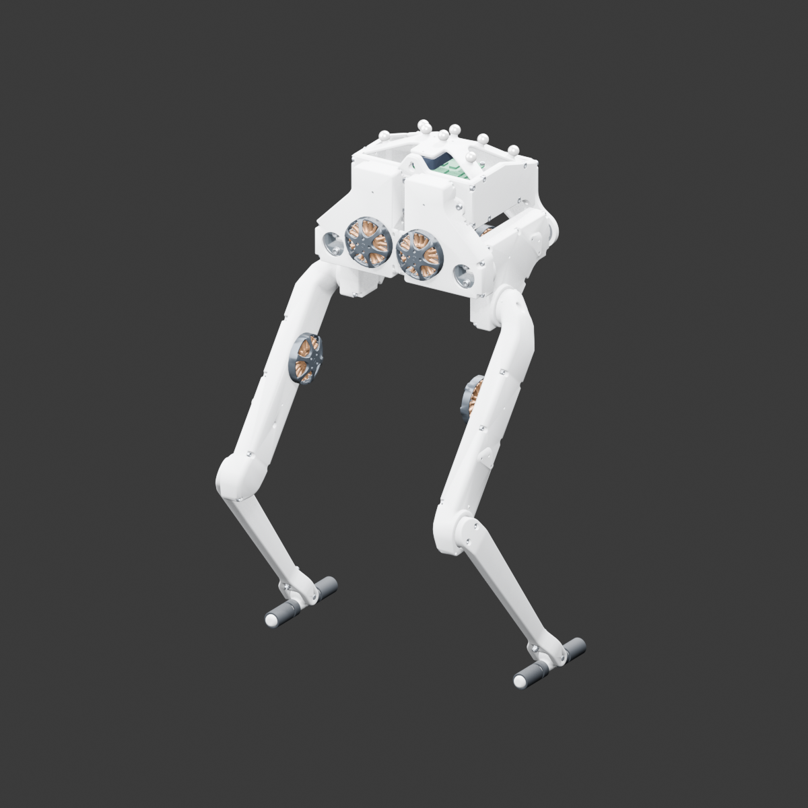
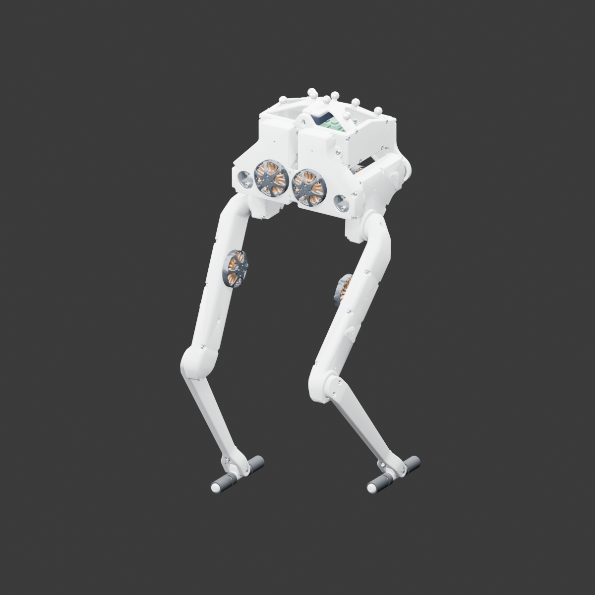

# Bolt 双足机器人接入记录

更新日期：2026-09-29。模型 ID：`robot.odri.bolt.6dof.v1`。

## 当前交付

官方 STEP 已通过免费、本地的 OCCT/XCAF 流水线转换为本项目的第三个模型。顶部“模型”菜单自动发现“Bolt 双足机器人”；无需 SolidWorks。已有源模型、分件 FBX、材质、中文目录、独立存档及关节教学演示。



| 项目 | 已核验基线 |
| --- | --- |
| 源定义 / 装配实例 | 56 个叶零件定义 / 345 个叶实例 |
| 分类模块 | 躯干、控制与感知，以及左右腿各 5 个模块，共 12 个 |
| 简单 / 进阶 / 探索 | 12 / 23 / 42 步，每档无遗漏、无重复覆盖同一批 345 个实例 |
| 尺寸 | 左右髋屈伸—膝、膝—踝轴距均为 200 mm；踝销长 28 mm |
| 运动轴 | 每腿髋侧摆、髋屈伸、膝屈伸三个主动轴；另有一个被动踝轴 |
| Source / LOD0 / LOD1 / LOD2 | 2,553,404 / 399,230 / 219,566 / 22,000 三角面 |
| LOD0 / LOD1 / LOD2 对象 | 345 个实例（12 个 FBX）/ 12 个合并模块 / 1 个整机对象 |

定义与实例数来自 XCAF 实际装配遍历，不是直接数 STEP 的 `PRODUCT`、关系实体或曲面。一个叶实例可以包含多个实体/曲面；这些数量不是制造采购 BOM 的逐件数量。200 mm 是平行转轴间的垂直距离，不能将沿轴错开的支承中心直接作欧氏距离来代替。

## 官方来源与许可

- 仓库：[Open Dynamic Robot Initiative 硬件](https://github.com/open-dynamic-robot-initiative/open_robot_actuator_hardware)。
- 固定提交：`66af1522b4fba0ec4a1d7790e66f5e4652208d30`。
- 原件：[biped_6dof_v1.STEP](https://github.com/open-dynamic-robot-initiative/open_robot_actuator_hardware/blob/66af1522b4fba0ec4a1d7790e66f5e4652208d30/mechanics/biped_6dof_v1/cad_files/STEP/biped_6dof_v1.STEP)，26,548,352 字节。
- 参考：[Bolt 总装说明](https://github.com/open-dynamic-robot-initiative/open_robot_actuator_hardware/blob/66af1522b4fba0ec4a1d7790e66f5e4652208d30/mechanics/biped_6dof_v1/README.md)及同提交的腿部、执行器和通用部件资料。
- 许可：[官方 BSD-3-Clause](https://github.com/open-dynamic-robot-initiative/open_robot_actuator_hardware/blob/66af1522b4fba0ec4a1d7790e66f5e4652208d30/LICENSE)。版权为 2019 New York University 与 Max Planck Gesellschaft；完整版权、条款及免责声明保留在 [发行许可文件](../../../Assets/StreamingAssets/MechanicalCatalog/Bolt/ODRI-BSD-3-Clause-LICENSE.txt)。不得暗示原机构为本游戏背书。

[source_manifest.json](../../../Assets/StreamingAssets/MechanicalCatalog/Bolt/source_manifest.json)记录实际获取的 24 个官方文件、固定提交 URL、大小、SHA-256 和 Git blob ID。获取器核对文件大小与固定 Git blob，包括已有缓存；转换器再核对 STEP 的 SHA-256。原 STEP 和构建依赖在忽略的 `Library/MechMaster/BoltSource/`，不进入游戏包；随项目保留的是派生模型、来源清单和许可，发行时也须携带上述许可说明。

## 转换与拆装边界

`fetch_bolt_sources.py → convert_bolt_step.py → import_bolt.py` 依次完成固定源获取、XCAF 装配解析和 Blender 内容生成。OCCT 按毫米读取，输出按米存储；Blender 仅作坐标轴转换，不任意缩放。每个源装配路径产生稳定 ID 和对象名，并记录源矩阵与网格中心。源对象使用四元数避免近 90° 姿态的欧拉分解误差；本机验证的最大旋转矩阵误差为 `4.77e-7`，中心位置误差为 0（Blender 浮点精度下）。

LOD0 保留所有实例和对象身份；减面只改变各定义的网格。材质为本项目制作的白色打印结构、深色传动/橡胶、金属、绕组铜色和绿色 PCB，不是原厂实测材质或照片贴图。LOD1/LOD2 已导出，但桌面样片仍全量加载 LOD0，尚未实施微信按需切换。

2026-09-30 在原 Editor 审计了实际加载的材质：浅色结构、深色传动/橡胶、铜色定子和绿色 PCB 均保留，没有整机材质丢失。外壳本来就以浅色为主；默认镜头额外偏航 55°，让部分内部颜色更容易看到，工作室灯光随偏航转动。引擎默认视角实拍见 [BoltDefaultView.png](../../Preview/BoltDefaultView.png)。

目录由 `Tools/Content/bolt_content.py` 生成：简单按整模块，进阶分壳体/驱动及主要功能系统，探索进一步区分传动、输出、反馈等维修单元。密封轴承、电子板焊接件、电机输入组合和重复紧固件仍整体操作；不会让儿童逐颗螺钉或拆散电机绕组。每档单条科普不超过 50 个字，正式发行仍需机械与教育编辑审稿。

## 关节教学演示

`BoltMotionRig.json` 保存 8 个轴、345 个对象绑定、源尺寸和 17 个闭合关键帧；`BoltMotionController` 从导入 FBX 的输出轮与支承轴承中心重建主动轴，从踝销重建被动轴。左右腿连续交替，髋膝错峰转向；周期、保形三次 Hermite 插值保持关键帧和循环接缝的角速度连续，不逐姿态整机停顿。每帧从源姿态计算父子运动矩阵，不改变层级，不累计角度漂移。

完整装配后可播放左右交替屈伸；默认速度 1.00×（一轮约 6 秒，以原 2.00× 的实际周期为新基准），支持暂停、继续、结束和相对新基准的 0.50×–1.50× 调速。髋侧摆 / 髋屈伸 / 膝 / 被动踝的教学相对角范围分别为 ±10° / ±20° / ±28° / ±40°，不是厂家安全限位。被动踝根据当前插值后的髋膝角度补偿，关键帧也校验这一约束，不增加虚构的踝电机。停止、拆装、爆炸、收纳和切换模型/等级均恢复源位置、旋转、父级与碰撞状态；演示不写拆装存档。



演示固定躯干，**不是能平衡行走的机器人仿真**。未模拟地面接触、足底保持、重心、负载、电机电流、皮带柔性或完整线缆；电机转子及各级皮带的实际传动自转也尚未制作。上述图片是实际运行网格的 Blender 渲染，不是 Editor Game View 截图。

## 可复现命令

已有 FBX 可直接打开工程。仅重建 STEP 流水线需要 Python 3.12、固定的构建依赖、Blender 4.5 LTS；在仓库根目录执行，并先关闭 Editor：

```powershell
# 替换为本机 Python 3.12 路径；构建依赖不安装进系统或运行端。
$boltPython = 'C:\Python312\python.exe'
& $boltPython Tools/Content/fetch_bolt_sources.py
& $boltPython -m pip install --no-deps `
  --target Library/MechMaster/BoltSource/parser/python `
  cadquery-ocp==7.8.1.1.post1 vtk==9.3.1
& $boltPython Tools/Content/convert_bolt_step.py

& 'C:\Program Files\Blender Foundation\Blender 4.5\blender.exe' `
  --background --python-exit-code 1 --python Tools/Blender/import_bolt.py
& 'C:\Program Files\Blender Foundation\Blender 4.5\blender.exe' `
  --background --python-exit-code 1 --python Tools/Blender/validate_bolt.py
dotnet run --project Tools/Tests/MechMaster.Domain.Tests.csproj -c Release

& 'C:\Program Files\Tuanjie\Hub\Editor\2022.3.62t15\Editor\Tuanjie.exe' `
  -batchmode -projectPath . `
  -executeMethod MechMaster.Editor.BoltImportValidator.ValidateFromCommandLine `
  -logFile Library/MechMaster/BoltSource/converted/editor-runtime-final.log
```

也可为转换器添加 `--audit-only`，先核对装配库存而不生成完整网格。`--python-exit-code 1` 必须保留，避免 Blender 在 Python 断言失败时仍返回 0。Editor 验证入口自行进入/退出 Play 并关闭进程，不加 `-quit` 或 `-nographics`；按本机安装路径调整命令。

仅调整动作时，直接以同样的 Blender 参数运行 `Tools/Blender/build_bolt_motion_rig.py`，从已有 Source 和清单重建 rig，无需重建源模型或分件 FBX。

## 验证与未完成项

2026-09-29 后续修订：原 2.00× 的实际节奏归一化为默认 1.00×，动作快慢不变；三级各 6 组结束/暂停/直接切换后单件爆炸与再点收回验证通过。原代码实际复现射线漏拾取、同步后命中的时序问题；修复在结束演示后和按下指针拾取前同步物理坐标，不开启全局逐帧同步。对照日志在 `Library/MechMaster/MotionRegression/`，参见 [开发与验证](../../DEVELOPMENT.md#演示结束后的点击回归2026-09-29)。

- .NET 19 项全部通过，包括已有自行车/Moveo 与 Bolt 的源身份、三档完整覆盖、关节轴和闭合关键帧，以及周期曲线的保形、速度连续和无整机停顿。
- 连续演示修订通过三级 `MECH_MASTER_BOLT_SMOOTH_OK`：关键帧和循环接缝一阶连续，512 个相位内角度均合规、踝补偿正确、无整机停顿；暂停/调速/停止复原和每档 6 组单件爆炸复测仍通过。旧版实际触发整机停顿断言，日志为 `Library/MechMaster/MotionRegression/baseline-bolt-smooth.log`；最终回归日志为同目录 `smooth-bolt-final.log`，退出码 0。此项不宣称微信真机帧率达标。
- Blender 源/LOD/尺寸/变换验证通过，日志包含 `BOLT_SOURCE_VALIDATION_OK`、`BOLT_TRANSFORM_VALIDATION_OK`。
- 团结引擎三档自动回归通过：资源绑定、真实射线拾取与拖入分类槽、爆炸不改进度、准确 ID 保存与恢复、任意顺序完整拆解/装回，以及关节轴对齐、腿长保持、固定躯干、暂停/调速、循环无漂移和停止复原。成功标记为各档 `MECH_MASTER_BOLT_MOTION_OK`、`MECH_MASTER_BOLT_TIER_OK` 以及最终 `MECH_MASTER_BOLT_RUNTIME_OK`；本轮 `editor-runtime-final.log` 无 C# 编译错误，进程退出码为 0。
- 验证前备份、退出 Play 后恢复全部模型的偏好和进度；测试日志与引擎姿态渲染在 `Library/`，不提交。
- 存档回归实际从已拆一件的保存状态重建计划和模型，确认该件保持收纳状态；完整装回后再次启动/结束演示，验证控制器没有将收纳位置误作源姿态。全部模型的资源绑定入口也通过，日志为 `editor-catalog-final.log`。
- 尚未完成人工 Game View 全流程、语音试听、微信导出、真机触摸及包体/帧率/内存验收；不能宣称微信性能达标或已发布。

后续改内容、运动或材质应编辑对应生成脚本并重跑，不直接修改生成后的 JSON/FBX。
