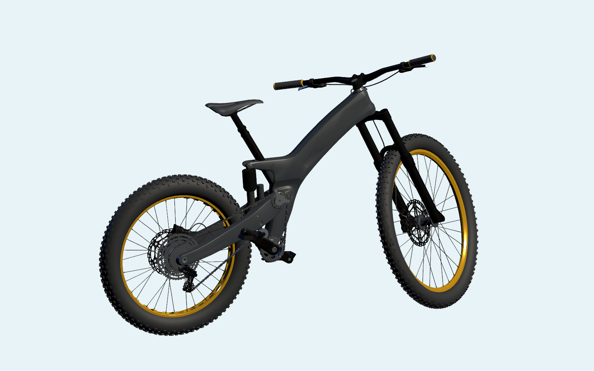
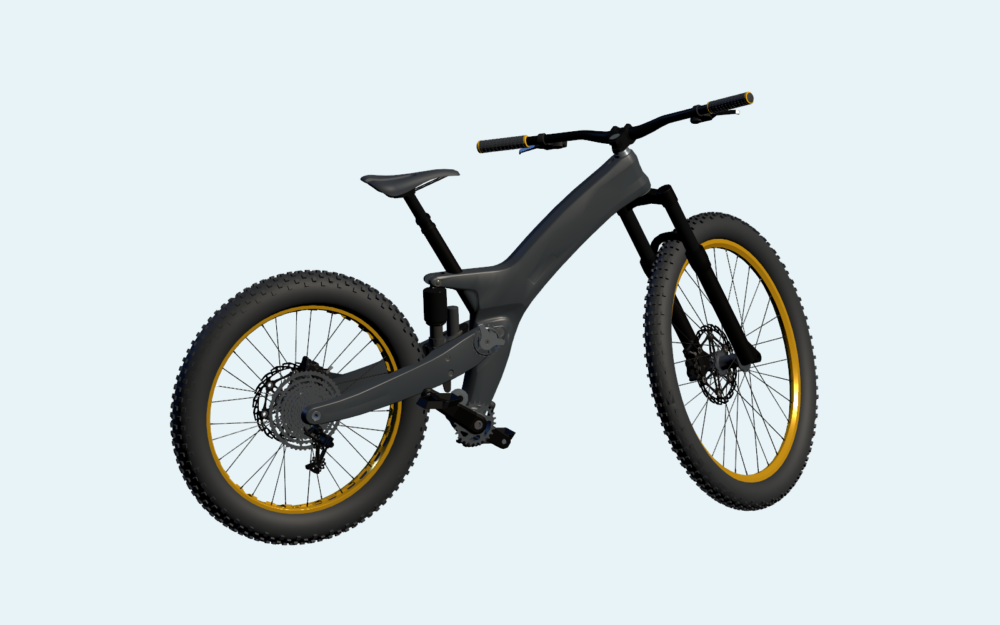

# Carbon Frame Bike 软尾接入记录

更新：2026-09-29。已完成本机团结引擎样片接入；微信导出、分包、触控与真机性能尚未验收。

## 当前交付

- 独立型号 `bike.carbon.full-suspension.v1`，菜单名“Carbon 软尾山地车”，与原有 2×10 硬尾自行车共存，各自存档。
- 14 模块、307 个可追溯分件网格；简单 / 进阶 / 探索为 **14 / 34 / 51** 个操作单元，每档无重复完整覆盖全部网格。
- 支持任意顺序拆装、分类收纳、中文知识与讲解、全局/单件爆炸、观察与独立进度。
- 前后悬架连续压缩回弹；默认 **1.00× / 4 秒一轮**，可暂停、继续、结束和 0.50×–1.50× 调速。停止后恢复姿态、可见管线/链条与碰撞拾取，不修改拆装进度。
- Source/LOD0 为 114,871 三角面，整车 LOD1 为 63,168，LOD2 为 22,000。运行样片仍加载全量 LOD0；不能据此宣称微信性能达标。

## 来源与校验

[作者发布目录](https://github.com/prefrontalcortex/glTF-Sample-Models/tree/carbon-frame-bike/2.0/CarbonFrameBike)；[原始项目](https://prefrontalcortex.de/en/projects/mixed-reality-bike/)。

- 固定提交 `93c72b11cf78dd6a3cd50b875d752cd7e6dd4ab2`，作者维护的 `carbon-frame-bike` 分支，不是已经合入 Khronos 正式资产库的型号。
- 模型：Robert Schweier（RobertS Bikes）。实时版本/动画：Felix Herbst / prefrontal cortex；支持：Needle。
- 原始 GLB：12,183,440 字节，匿名直接下载，无需 Sketchfab 账户。
- SHA-256：`95c016737df48d1beaa7bb5d6eb4789d8102013a246c59bdf6a25021fa264373`。
- Git blob：`121959c4b83c1f88c82a4df94e8a60b481ff6338`；抓取脚本核对固定 Git 树与 blob，匿名 API 限额时沿用已核实的固定校验值，不跳过验证。
- 官方原件放在忽略的 `Library/MechMaster/CarbonFrameBikeSource/official/`；来源清单、作者 README、完整许可和修改声明随 `Assets/StreamingAssets/MechanicalCatalog/CarbonFrameBike/` 分发。

## 许可与标识处理

作者 [README](https://github.com/prefrontalcortex/glTF-Sample-Models/blob/93c72b11cf78dd6a3cd50b875d752cd7e6dd4ab2/2.0/CarbonFrameBike/README.md)声明 [CC BY-SA 4.0](https://creativecommons.org/licenses/by-sa/4.0/)。派生 Source、FBX、模型材质和教学预览按相同许可提供，保留作者、许可链接与修改记录；独立应用代码和其他模型不因此整体改用该许可。

[Khronos 问题 #83](https://github.com/KhronosGroup/glTF-Sample-Assets/issues/83)的标识许可审查尚未解决。本次派生资产实际删除四个可见标识网格（车架两侧及头管），替换全部作者贴图/程序材质为无贴图中性 PBR，去掉轮胎上的 NEEDLE / PREFRONTAL CORTEX 图像标识。原始 GLB 不作为发行资源；Source 无作者图像，运行材质无贴图引用。署名仍完整保留，不暗示品牌背书。此处理不代表关闭上游问题，也不声称获得独立商标授权；发行前仍需按实际资源/地区复核权利义务。

## 几何、尺寸和拆装边界

实际 GLB 有 757 节点、312 网格定义、31 材质、11 图像和四套管线蒙皮。不能把节点数当零件数：排除三张 AR 阴影平面、四个标识网格及 Blender 生成的非源骨骼可视形状，保留 **307 个源网格实例**。稳定 ID 使用固定 GLB 节点索引，中文名称与操作组由源路径语义生成。

采用作者动画第 0 帧的闭合装配姿态，将蒙皮管线烘焙为静态网格，保留源几何和原有转向角。验证逐顶点对照原始 GLB；无需任意缩放或重造车架。源后避震器上下安装原点间距约 **200.03 mm**，与 `200-57` 名称中的 200 mm 对照，通过米制校验。`57` 只是作者的行程标注，未据此声称测得可用行程。

前轮的源名称为 `Reifen_584x75 / Felge_584x24_32Loch`，后轮为 `Reifen_507x100 / Felge_507x46_32Loch_Kabra`。这些是溯源标签，不是本次核定的完整轮胎尺寸表；网格尺寸与命名可能有差异。保留不对称车轮，不套用硬尾车的 27.5×2.25、2×10、36/24T 演示或链节数量。这不是 Santa Cruz V10，不补造 VPP 连杆或厂家制造公差。

后避震器在所有等级保持封闭整体；密封轴承不拆内部球/密封圈；铆接碟片、飞轮组合、粘合坐垫与座轨保持整体。辐条/辐条帽、紧固件按功能组操作，左右脚踏各为一件。307 是网格实例数，不是 307 个维修步骤，也不保证源模型包含全部现实内部机构。

## 动态实现边界

`CarbonFrameBikeMotionRig.json` 的七个空节点锚点来自源装配，不把任意包围盒中心冒充铰点。后摇臂绕源主转点摆动，前叉下组件沿上下源原点方向滑动；固定上眼和移动下眼实时求解后避震角度与伸缩，使两端保持连接。FBX 坐标手性变化后，从后轴向上运动确定压缩方向。

教学幅度：后摇臂最大 8°、前叉压缩 45 mm，后避震压缩约 18 mm；不是厂商极限行程。`SuspensionTeachingCycle` 使用闭合余弦曲线，转向处自然减速，不逐段停顿。每帧从源姿态求值，不换父级、不累积姿态漂移。

演示期间暂隐单块链条和四段柔性管线/接头，避免固定网格表现成错误的跟随或拉伸；UI 明示暂隐，停止后恢复原始可见性。未实现踩踏、链条路径更新、软管形变、液压/气压阻尼、轮胎接地、骑手平衡或承载仿真。菜单的“运转演示”在该模型上是悬架教学视图。

## 验证结果

- .NET：**24 项全通过**，新增固定源身份、标识排除、三级完整覆盖、密封服务边界与连续周期测试。
- Blender：Source 全部网格逐顶点与原始 GLB 一致（误差阈值 0.3 μm）、无作者图像/贴图；14 模块 FBX 回导保持身份与米制位置，LOD1/2 数量和面数通过。
- 团结引擎：C# 编译、五模型绑定、Carbon 三级 14/34/51 步、307 网格、200 mm 后避震轴距通过；257 个相位检查刚性、前叉平移、后避震眼距/伸缩、闭环、暂停和实际调速。
- 每级各六组演示后单件爆炸/再点收回及拆装实际指针回归，原生播放/结束/“拆装零件”按钮、射线拾取、拖动入分类区、准确存档、重载、任意顺序完整拆装均通过。
- 五模型切换后播放、暂停、恢复、停止与爆炸通过。验证在忽略的独立测试工程完成，使用单独 company/product 隔离存档，退出恢复测试前偏好；没有关闭原工程 Editor。
- 日志：`Library/MechMaster/CarbonFrameBikeSource/{import.log,validate.log,editor-runtime-final.log,editor-catalog-final.log}`。成功标记 `CARBON_SOURCE_LOD_VALIDATION_OK`、三级 `MECH_MASTER_CARBON_TIER_OK`、最终 `MECH_MASTER_CARBON_RUNTIME_OK`；最终交互回归和静态绑定进程退出码均为 0。自动化不代替用户实际 Game View 与微信真机验收。





以上是实际引擎的统一取景模型渲染，不是含 UI 的 Game View 截屏或 AI 插画。Blender 中性材质预览另存 `Docs/Preview/CarbonFrameBike.png` 和 `CarbonFrameBikeSuspension.png`。

## 可复现命令

在仓库根目录执行，按本机位置替换 Python/Blender/团结引擎路径：

```powershell
python Tools/Content/fetch_carbon_frame_bike_sources.py
& 'C:\Program Files\Blender Foundation\Blender 4.5\blender.exe' --background --python-exit-code 1 --python Tools/Blender/import_carbon_frame_bike.py
& 'C:\Program Files\Blender Foundation\Blender 4.5\blender.exe' --background --python-exit-code 1 --python Tools/Blender/validate_carbon_frame_bike.py
dotnet run --project Tools/Tests/MechMaster.Domain.Tests.csproj -c Release
```

源文件详细审计可选 `audit_carbon_frame_bike.py`，输出只放忽略缓存。正常生成不依赖该缓存报告。引擎交互验证使用 `MechMaster.Editor.CarbonFrameBikeImportValidator.ValidateFromCommandLine`，`-batchmode`、**不加 `-quit`**，入口自行进入/退出 Play；与其它验证器一样，在原 Editor 开启时复制到独立工程运行，禁止两个 Editor 同时占用原工程。

修改应进入 `carbon_frame_bike_content.py` / `import_carbon_frame_bike.py`，重新生成目录与资产；不要手改生成 JSON/FBX 或改变旧硬尾车的存档 ID。
