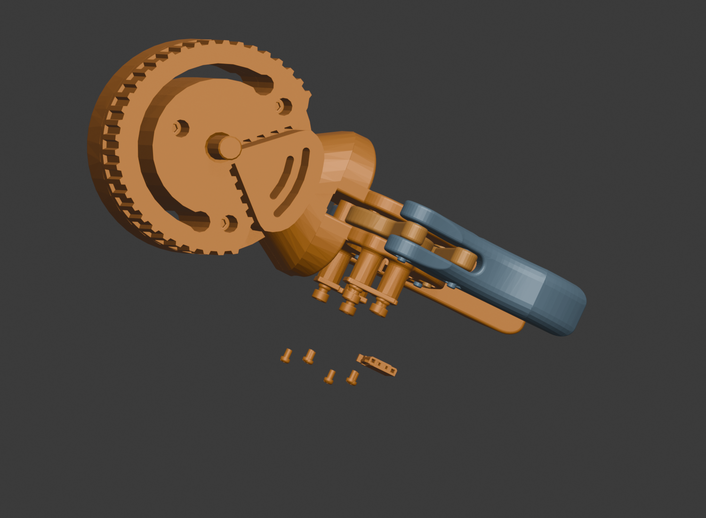

# Moveo 机械臂接入记录

更新日期：2026-09-29（默认速度与演示后拾取修复）。用户已授权将 Moveo 加入工程，并允许遇到卡点时暂停询问。

## 当前状态

2026-09-29 修订：默认演示速度为 1.00×（一轮约 10 秒，以原 2.00× 的实际节奏为新基准），调速范围为相对新基准的 0.50×–1.50×；结束/暂停后切换单件爆炸和再次点同一件收回已补回归。每档 6 组实测均通过，运行时在结束演示后及拾取前同步物理坐标；不依赖下一次物理刷新。复现与修复日志位于 `Library/MechMaster/MotionRegression/`，细节见 [开发与验证](../../DEVELOPMENT.md#演示结束后的点击回归2026-09-29)。

用户确认本机没有可用的 SolidWorks。现已建立免费本地转换流水线，从官方总装保存的显示网格与分件变换恢复机械臂，新增 `arm.bcn3d.moveo.v1` 模型清单、运行资源和三档拆装目录。

- **9 个模块、87 个源 CAD 零件定义、366 个独立实体**。
- 简单 / 进阶 / 探索为 **9 / 20 / 42 步**；每档无重复、无遗漏覆盖同一批实体，讲解每段不超过 50 字。
- 接入模型发现、分类托盘、自由拖动拆装、爆炸视图、旋转缩放平移、中文讲解和独立本地存档。
- Source **1,627,471 三角面**；分件 LOD0 共 **447,667**，整机 LOD1 **268,593**、LOD2 **34,999 三角面**。


## 已获取与检查

- 官方来源：[BCN3D/BCN3D-Moveo](https://github.com/BCN3D/BCN3D-Moveo)，固定提交 `0866a92501277636f76000a195d8a16d44b5b476`。已下载 CAD、STL、45 页装配手册、2 页 BOM、README 和 MIT 许可；本机文件缓存位于 `Library/MechMaster/MoveoSource/official/`。
- 已完整取得整机 `CAD files/BCN3D Moveo assembly.SLDASM` 和仓库内引用的零件/子装配。官方仓库的整机格式为 SolidWorks，没有可直接读取的完整 STEP 装配。
- 检查了本机程序、运行进程和已安装软件记录，未找到可用的 SolidWorks、Solid Edge、CAD Exchanger 或 FreeCAD。现有 Blender 可读取 STL，但不能直接解释原始 SolidWorks 装配及其分件变换。
- 同时取得 [Jesse Weisberg 的 ROS 转换工程](https://github.com/jesseweisberg/moveo_ros)，固定提交 `b9282bdadbf2505a26d3b94b91e60a98d86efa34`，包含 CAD 导出的各关节 STL 和 URDF 关节坐标。仓库附 MIT 文本；`moveo_urdf/package.xml` 元数据另写 BSD，原始声明均保留在缓存中，不将两者混写成同一许可文本。
- 按 URDF 坐标在 Blender 4.5 中装配 12 个视觉网格，并分离出 484 个几何壳体。壳体数量不是已认定的独立机械零件数，尤其电机及电子件可能包含多个不可单独维修的几何体。
- 检查了 ROS 两套 URDF 坐标及社区 Fusion 文件；本次运行资产采用官方总装保存的几何及变换。历史 ROS 截图和许可仅保留为过程记录。官方舵机含弯曲引线，不能仅凭悬垂外观将其判定为错位紧固件。



## 免费转换、清理与尺寸核验

官方总装为旧版 OLE 文件。本项目读取其中的 `Contents/DisplayLists__ZLB` 三角网格和 `COMPINSTANCETREE` 装配变换，展开重复实例，保持原始位置。首次隐藏实例也可能拥有后续可见实例共用的网格，因此先恢复定义，再筛选实例。转换无需 SolidWorks、付费转换器或账号。

条带解析参考 [Josh Donner 的 MIT 开源解析研究](https://github.com/Wintaru/model_viewer/blob/9aabcab92cfaaac03b1276229e11ce798b60e6f9/research/d9-decode.py)，许可保留于 `Tools/Content/ThirdParty/Wintaru-MIT-LICENSE.txt`。本次全部定义与参考解析器逐顶点、逐索引一致，共恢复 535,939 个定义级三角面。

清理记录随 `moveo_model_manifest.json` 保存：

1. 排除源配置的 18 个隐藏或抑制引用，包括重复盖板、螺钉和嵌件。
2. 排除没有保存几何的 `2M2M assembly` 空装配引用，不计作实体。
3. `4M/2` 独立舵机与夹爪总成内的舵机相交，中心距离不足 0.5 mm；官方 BOM 只列一个舵机。保留夹爪中的实例，清除这个重复舵机。其余采用实例保持官方装配位置。
4. 顶层无功能分类的紧固件，按原始位置与实际支承表面的距离归类，并记录支承对象和距离以供复核。

源模型单位为米。木底板实测 **550 × 550 × 16 mm**；源标注 140 / 121 / 80 mm 的光轴网格长度分别为对应值，直径 8 mm。没有通过预览图估算尺寸或任意缩放。

## 可复现文件

- 获取脚本：`Tools/Content/fetch_moveo_sources.py`；默认只获取官方资料；传入 `--include-ros` 同时获取本次审计用的社区转换。全部下载和解压留在忽略的 `Library/`，不作为游戏运行资产。
- [源文件记录](source_manifest.json)：固定提交、归档 URL、归档与每个下载文件的 SHA-256；记录包含本次官方与 ROS 获取结果。
- [官方 MIT 文本](BCN3D-MIT-LICENSE.txt)和 [ROS 仓库 MIT 文本](ROS-MIT-LICENSE.txt)。正式发行时需随采用的素材保留适用许可及版权声明。

复现命令（仓库根目录）：

```powershell
python Tools/Content/fetch_moveo_sources.py
python -m pip install --target Library/MechMaster/MoveoSource/parser/python olefile==0.47
python Tools/Content/convert_moveo_solidworks.py
& 'C:\Program Files\Blender Foundation\Blender 4.5\blender.exe' `
  --background --python Tools/Blender/import_moveo.py
dotnet run --project Tools/Tests/MechMaster.Domain.Tests.csproj -c Release
```

中文内容与分组修改 `Tools/Content/moveo_content.py`；几何清理、材质与 LOD 修改 Blender 导入脚本后重跑。官方 MIT 版权和许可随运行资产位于 `Assets/StreamingAssets/MechanicalCatalog/Moveo/`；运行来源记录只包含实际采用的官方素材。

## 验证与边界

- Python 转换、Blender 生成和运行资产预览检查完成。
- .NET **15 项全部通过**，包含 Moveo 稳定身份、三档完整覆盖、单舵机、焊接电子件同组、讲解字数及关节演示配置、五轴顺序、轴支承和夹爪四连杆关键帧。
- 团结引擎导入、编译及所有模型的目录绑定通过。已修正缺省 `motion` 被 `JsonUtility` 读为空对象时的模型校验问题。
- Play Mode 三档回归通过：9 / 20 / 42 步均完成实际射线拾取、拖入分类托盘、全局爆炸与收回、准确保存已拆 ID、逆序完整拆解及装回。全部 366 个节点恢复原位，切回自行车后动态演示绑定正常。
- 自动回归入口为 `MechMaster.Editor.MoveoImportValidator.ValidateFromCommandLine`，完成标记为 `MECH_MASTER_MOVEO_RUNTIME_OK switch,bind,ray-pick,drag,explode,save,reassemble`。运行前保存已有模型、等级、讲解与拆装进度，退出 Play 后恢复；本机日志位于忽略的 `Library/MechMaster/MoveoSource/converted/editor-runtime.log`。
- 已人工检查 Blender 生成的实际 LOD0 预览；尚未人工复核团结引擎 Game View 的画面和手势。
- Moveo 关节演示已接入 `moveo-articulation-v1`：底座、肩、肘、腕旋转、腕俯仰五轴循环，夹爪两侧齿轮 / 四连杆同步开合；默认速度 1.00×（保持原 2.00× 的实际节奏），调速范围为相对新基准的 0.50×–1.50×，暂停、继续、结束和切换视图都会保持拆装进度并恢复源姿态。配置文件为 `Assets/Resources/MechanicalCatalog/MoveoMotionRig.json`，生成脚本为 `Tools/Blender/build_moveo_motion_rig.py`。
- 自动回归额外检查关节动作、夹爪闭合、循环无漂移、固定底座不移动、支承轴保持、暂停与调速、碰撞状态恢复以及爆炸 / 拆装视图会停止演示；成功标记为 `MECH_MASTER_MOVEO_MOTION_OK`。本轮已重新启动团结 Editor 验证，`Library/MechMaster/MoveoSource/converted/editor-runtime-motion.log` 同时记录 Simple / Standard / Advanced 三档的该标记，且进程退出码为 0。

当前是官方保存的网格和装配快照，不是参数化实体或制造公差模型。源 CAD 没有完整同步带体和电气线束，本次未补造；CAD 与手册 BOM 的部分型号、轴长及数量存在版本差异，源名用于追溯，展示 BOM 不作为采购清单。电机、舵机和轴承保持完整维修单元，焊接电子件随驱动板整体处理。关节演示是基于保存网格和支承轴的运动学教学循环，不是电机、控制器、负载、碰撞或真实动力学仿真。**微信真机包体、内存、帧率和触控仍未验收。**
