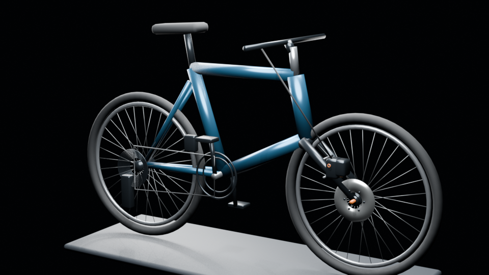
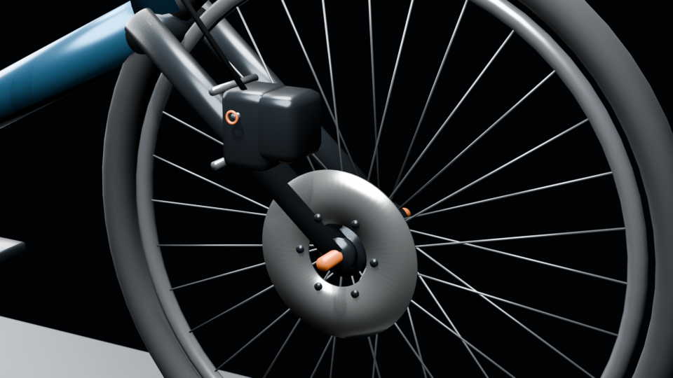

# 机械大师

> 拆解万物，解锁机秘

面向 6–12 岁儿童与青少年的写实机械拆装科普游戏。首版以 2×10 山地自行车为载体，通过真实比例 3D 模型、零件点选、工具选择和正反向拆装流程，帮助玩家理解机械部件的名称、用途与连接关系。





## 当前状态

仓库包含一个可以继续在团结引擎/Unity 2022 LTS 技术栈上开发的首版样片：

- 真实米制尺寸、允许自由旋转与缩放的 3D 自行车。
- 前轮、液压碟刹和花鼓端盖的分级拆装流程。
- 启蒙、探索、进阶三档难度，分别包含 4、8、12 个操作步骤。
- 选择工具后拖动零件，松手完成拆下或装回。
- 点击零件显示名称、作用、机械原理和进阶说明。
- 本地保存难度、工具、拆装进度与讲解开关。
- 不包含星级、徽章、排行榜和付费激励。

微信小游戏 AppID 尚未申请，因此当前完成的是引擎侧可运行样片和平台适配边界；申请 AppID、安装对应团结引擎微信小游戏模块后再进行真机打包。

## 为什么使用 C#

项目按团结引擎/Unity 的主流工作流实现。引擎运行时脚本语言是 C#，不是 Java；Java 主要用于传统 Android 原生层。微信小游戏构建由团结引擎把 C# 业务逻辑转换为目标运行环境，游戏业务无需改写成 Java。

## 首版范围

首版整车为带前后变速结构的 2×10 山地自行车，当前可交互样片聚焦前轮液压碟刹区域。

| 难度 | 主要年龄 | 零件粒度 | 步骤数 | 知识深度 |
| --- | --- | --- | ---: | --- |
| 启蒙 | 6–8 岁 | 轮组、刹车总成等大组件 | 4 | 名称与直观作用 |
| 探索 | 9–12 岁 | 固定销、来令片组、卡钳、碟片 | 8 | 作用与工作原理 |
| 进阶 | 9–12 岁 | 保险卡、单片来令片、弹簧、端盖等 | 12 | 更细结构与安全提示 |

困难模式只增加零件拆分粒度，不要求玩家输入工具规格或扭矩。刹车油模拟流程计划在后续版本加入，并可覆盖所有难度。

## 操作方式

- 触摸屏：单指拖动空白区域旋转视角，双指缩放。
- 桌面端：按住鼠标右键旋转，滚轮缩放。
- 拆装：先在左侧选择工具，再按住目标零件拖动，松手后执行操作。
- 点选：轻点零件查看名称和科普内容，不改变拆装状态。
- 组装：完整拆解后切换组装模式，按拆解的相反顺序装回。

## 技术方案

- 客户端与交互：团结引擎/Unity 2022 LTS 基线，C#。
- 目标平台：微信小游戏；当前也可先在编辑器内验证。
- 3D 制作：Blender 4.5 LTS，Python 可重复生成。
- 业务测试：.NET 8 控制台测试，无第三方测试依赖。
- 存档：首版本地 `PlayerPrefs`，后续通过接口替换为微信存储。
- 资源加载：首版使用 `Resources`；量产内容改为分包与远程资源。

## 项目结构

```text
Mech.Master/
├─ Assets/
│  ├─ Art/Models/Source/        # Blender 源文件
│  ├─ Resources/                # 首版运行时 FBX
│  ├─ Scenes/                   # 启动场景
│  └─ Scripts/
│     ├─ Domain/                # 无引擎依赖的拆装规则
│     ├─ Runtime/               # 3D、输入、UI、存档、音频
│     └─ Editor/                # 编辑器资产校验
├─ Docs/
│  ├─ ARCHITECTURE.md
│  ├─ PRODUCT_SPEC.md
│  ├─ DEVELOPMENT.md
│  ├─ Preview/
│  └─ References/
├─ Packages/                    # Unity/Tuanjie 包配置
├─ ProjectSettings/             # 引擎项目设置
└─ Tools/
   ├─ Blender/                  # 模型生成与校验脚本
   └─ Tests/                    # 领域规则测试
```

## 快速开始

### 1. 验证领域规则

需要 .NET 8 SDK 或更高版本：

```powershell
dotnet run --project Tools/Tests/MechMaster.Domain.Tests.csproj -c Release
```

预期六项测试全部显示 `PASS`。

### 2. 重新生成 3D 资产

需要 Blender 4.5 LTS。Windows 示例：

```powershell
& 'C:\Program Files\Blender Foundation\Blender 4.5\blender.exe' `
  --background `
  --python Tools/Blender/generate_bicycle.py
```

生成结果：

- `Assets/Art/Models/Source/BicyclePrototype.blend`
- `Assets/Resources/BicyclePrototype.fbx`
- `Docs/Preview/BicyclePrototype.png`
- `Docs/Preview/FrontBrakePrototype.png`

### 3. 校验模型

```powershell
& 'C:\Program Files\Blender Foundation\Blender 4.5\blender.exe' `
  --background Assets/Art/Models/Source/BicyclePrototype.blend `
  --python Tools/Blender/validate_bicycle.py
```

当前基准：

| 指标 | 数值 |
| --- | ---: |
| 轴距 | 1.120 m |
| 前轮外径 | 0.698 m |
| 前碟片直径 | 0.180 m |
| 网格对象 | 40 |
| 顶点 | 8,256 |
| 多边形 | 7,274 |

### 4. 在编辑器中运行

1. 使用团结引擎或兼容的 Unity 2022 LTS 编辑器打开仓库根目录。
2. 等待 Package Manager 和资源导入完成。
3. 打开 `Assets/Scenes/Main.unity`。
4. 点击 Play；运行时会自动创建摄像机、灯光、UI 和游戏入口。
5. 可通过菜单 `机械大师 → 验证首版样片` 检查模型对象名和三档步骤数。

当前机器只安装了团结引擎 Hub，尚未安装完整编辑器，因此仓库内没有伪造编辑器实测结果；首次打开后应执行一次编译和 Play Mode 验证。

## 微信小游戏后续接入

1. 取得微信小游戏 AppID。
2. 在团结引擎 Hub 中安装与项目兼容的编辑器和微信小游戏构建支持。
3. 在 Package Manager 中安装官方微信小游戏转换/构建包。
4. 配置产品名称、包体裁剪、纹理压缩和分包策略。
5. 导出至微信开发者工具，完成模拟器与真机性能测试。
6. 替换本地存档和资源加载实现，但保持领域层不变。

平台集成必须放在适配层，不能在 `MechMaster.Domain` 中直接调用微信 API。

## 内容与安全原则

- 结构、名称与拆装顺序以厂商公开维修手册及通用自行车维修规范为依据。
- 游戏用于科普和拆装乐趣，不替代真实车辆维修指导。
- 首版不要求扭矩、工具规格或刹车油实操。
- 涉及制动系统的真实维修应由监护人或专业技师完成。
- 儿童模式默认不收集账号、位置、通讯录或行为画像。
- 新增第三方字体、图片、模型或音频前必须记录来源和许可。

## 相关文档

- [产品规格](Docs/PRODUCT_SPEC.md)
- [系统架构](Docs/ARCHITECTURE.md)
- [开发与验证](Docs/DEVELOPMENT.md)
- [资料来源](Docs/References/SOURCES.md)
- [音频资产规则](Assets/Audio/README.md)

## 版本控制

当前直接在 `main` 分支开发，由项目所有者负责提交和推送。请勿提交 `Library/`、`Temp/`、`obj/`、`bin/`、`__pycache__/` 或 Blender 自动备份文件。
