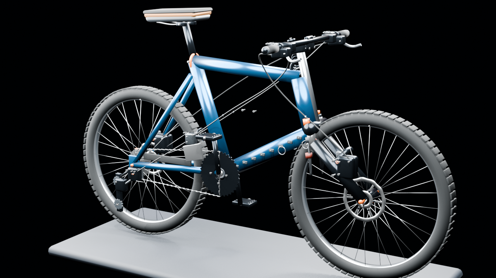
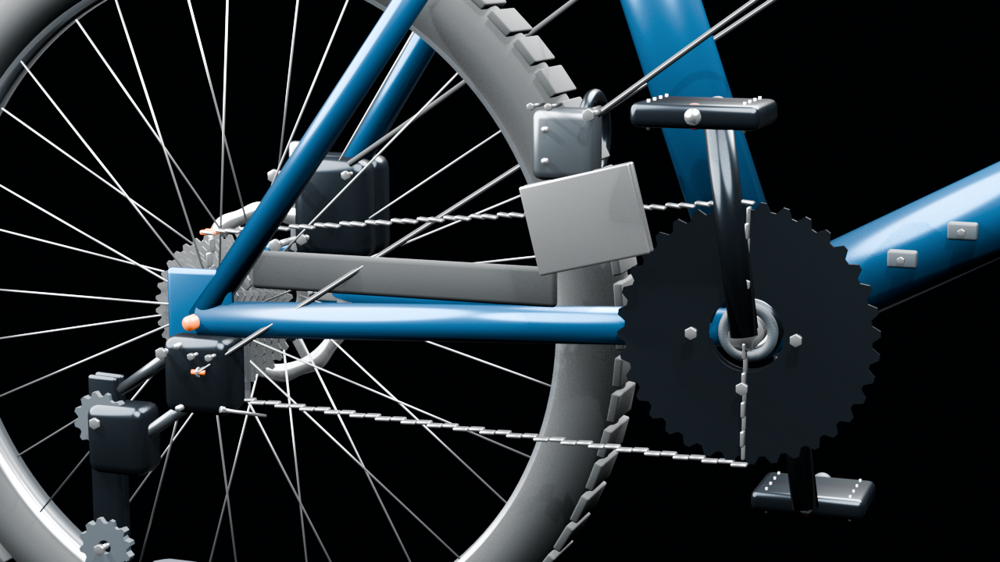

# 机械大师

> 拆解万物，解锁机秘

面向 6–12 岁儿童与青少年的写实机械拆装科普游戏。项目按微信小游戏立项，首个完整机械模块是一台无品牌、M 码、27.5 英寸、2×10 铝合金硬尾山地车。





## 当前交付

- 1:1 米制源模型，允许自由旋转和缩放。
- 14 个机械模块、195 类零件、595 个独立实体单元。
- 前后各 32 根辐条、110 节链条、10 片飞轮及前后制动内部件均有稳定 ID。
- 简单 / 进阶 / 探索分别为 15 / 30 / 45 个拆装步骤；模型仍保留 595 个独立实体。
- 所有步骤都绑定真实模型对象，并提供名称、作用、原理和进阶说明；每档零件讲解不超过 50 个字。
- 可自由选择机械单元并直接拖入对应分类托盘；拆解和组装都不限制先后顺序，也不校验工具。
- 提供全局一键爆炸和点击单件爆炸两种三维观察方式；爆炸视图不改变拆解进度或存档。
- 本地保存拆解等级、准确的已拆零件集合、组装模式和讲解开关。
- 运行时自动发现模型清单；模型资源、三级目录和分类由各模型配置驱动，存档按模型分别保存。
- Source、模块 LOD0、整车 LOD1 和 LOD2 四层资产流水线。
- 不包含星级、徽章、排行榜、付费激励、工具规格或扭矩考核。

当前还没有微信小游戏 AppID。自行车原型此前通过本机团结引擎 Editor 的导入、编译和 Play Mode 验证；本次通用模型重构已通过导入、编译、目录绑定与批处理 Play Mode 启动校验，仍需人工复核手势与画面，并完成微信开发者工具及真机测试。

## 三档拆解等级

| 拆解等级 | 拆装粒度 | 步骤数 |
| --- | --- | ---: |
| 简单 | 整车主要机械模块 | 15 |
| 进阶 | 模块内按功能系统分组 | 30 |
| 探索 | 更细的机械子总成，紧固件和重复件仍成组 | 45 |

三个等级都覆盖完整的 595 个模型实体，只改变一次拖动所包含的范围。探索等级也以机械子总成为单位，链节、辐条、紧固件和内部小件不会逐个操作；焊接、粘接、硫化和铆死结构不作为常规拆装操作。刹车油流程计划在后续覆盖所有等级。

## 工程基准

| 项目 | 数值 |
| --- | ---: |
| 轮胎 | ETRTO 57-584 |
| 轮外径 | 698 mm |
| 轴距 | 1120 mm |
| 前叉 | 120 mm 气压避震 |
| 前 / 后花鼓 | 15×110 / 12×148 mm |
| 中轴 | BSA 73 mm |
| 牙盘 | 36/22T |
| 飞轮 | 11–36T，10 速 |
| 前 / 后碟片 | 180 / 160 mm，六钉式 |

这里的“工程级”指维修训练级：比例、接口、部件层级和装配关系可信，不宣称具备原厂制造公差、有限元分析或真实油液计算精度。

## 技术方案

- 团结引擎 / Unity 2022 LTS 技术基线，运行时使用 C#，不是 Java。
- Blender 4.5 LTS + Python 重建可重复的 3D 资产。
- .NET 8 控制台测试领域规则和内容目录，无第三方测试依赖。
- 首版使用 `Resources` 和 `PlayerPrefs`；正式微信版本再接分包、缓存和平台存储。

## 项目结构

```text
Assets/
├─ Art/Models/Source/BicycleEngineeringSource.blend
├─ Resources/
│  ├─ MechanicalCatalog/BicycleInteractionCatalog.json
│  ├─ MechanicalCatalog/Models/Bicycle.json # 自动发现的模型清单
│  └─ Models/Bicycle/             # 14 个模块 LOD0 + 整车 LOD1/LOD2
├─ StreamingAssets/MechanicalCatalog/
│  ├─ bicycle_engineering.json    # 工程 BOM
│  ├─ bicycle_model_manifest.json # 595 个对象映射
│  └─ bicycle_runtime_assets.json # 运行资产统计
└─ Scripts/
   ├─ Domain/                     # 纯 C# 拆装状态机
   ├─ Runtime/                    # 3D、输入、UI、存档
   └─ Editor/
Docs/
Tools/
├─ Blender/                       # 生成、LOD 导出、验证
├─ Content/                       # 三档交互目录生成
└─ Tests/                         # .NET 规则与目录测试
```

## 重新生成与验证

需要 Blender 4.5 LTS 和 .NET 8 SDK。

```powershell
# 1. 生成 595 分件工程源模型与预览图
& 'C:\Program Files\Blender Foundation\Blender 4.5\blender.exe' `
  --background --python Tools/Blender/generate_engineering_bicycle.py

# 2. 导出 14 个模块 LOD0 和整车 LOD1/LOD2
& 'C:\Program Files\Blender Foundation\Blender 4.5\blender.exe' `
  --background --python Tools/Blender/export_engineering_lods.py

# 3. 根据 BOM 与模型清单生成三档交互目录
& Tools/Content/Generate-BicycleInteractionCatalog.ps1

# 4. 校验零件、尺寸、LOD 与目录
& 'C:\Program Files\Blender Foundation\Blender 4.5\blender.exe' `
  --background --python Tools/Blender/validate_engineering_bicycle.py

# 5. 执行领域与内容绑定测试
dotnet run --project Tools/Tests/MechMaster.Domain.Tests.csproj -c Release
```

当前验证基线：595 个零件对象、585 个网格对象、119,306 顶点、111,694 面；LOD1 为 14 个对象 / 71,305 面，LOD2 为 1 个对象 / 26,671 面。刹车油管和变速线管沿车架外走线，水壶架螺栓固定于下管安装座，坐垫采用带减压凹槽的曲面模型；传动系统采用 36T/22T 双盘和圆头链片包络，前叉内部件保持同轴，脚踏为镂空平台结构。

## 在编辑器中运行

1. 使用团结引擎或兼容 Unity 2022 LTS 编辑器打开仓库根目录。
2. 等待 FBX、JSON 和脚本导入完成。
3. 打开 `Assets/Scenes/Main.unity`。
4. 点击 Play。运行时会装载 14 个模块 LOD0，并自动创建摄像机、灯光、UI 和碰撞热区。
   顶部“模型”菜单位于“旋转视角”左侧，只显示已经交付且通过资源校验的模型；目前仅有自行车。
5. 默认进入“旋转视角”：在车身或空白处按住鼠标左键 / 单指拖动即可旋转，轻点零件查看百科；滚轮 / 双指可缩放。
6. 点击顶部“拆装零件”后，直接把机械单元拖入对应分类区；空白处仍可旋转，桌面端右键也可旋转。“整机归位”恢复完整取景，不修改拆装进度。
   右下角“画面平移”四向按钮按屏幕方向移动画面，可配合旋转和缩放；“中”只取消平移，保留旋转和缩放。“整机归位”同时重置三者。
7. 左侧“三维爆炸视图”可选择“全局一键爆炸”或“点击单件爆炸”。全局模式按当前拆解等级的 15 / 30 / 45 个逻辑机械单元整体展开；局部模式轻点一个零件弹开，再点一次收回。两种模式都支持继续旋转、缩放和平移，只改变观察位置，不写入拆解进度。
8. 左侧“拆解等级”和右侧“零件百科”可收起，底部分类区压缩为两行。相机根据中间可用区域自动构图；“查看收纳”将已拆零件和 3D 展示托盘纳入取景，进入组装时自动切换到此视图。
9. Windows Editor 内置本地中文讲解：点击零件、成功拆装或点击“再次讲解”即可播报；每条零件讲解不超过 50 个字；关闭讲解会停止当前声音。

本地讲解使用已安装的 Windows 中文语音，不联网；首次导入自动编译语音辅助程序到 `Library/MechMaster/`。这不是微信语音实现，其他平台会明确显示“语音待就绪 / 当前平台语音待接入”。详细依赖和排查方式见[开发与验证](Docs/DEVELOPMENT.md)。

通用模型重构后请在完整编辑器中再做一次 Play Mode 交互复核；自动化结果不替代手势与画面检查。

## 微信小游戏后续接入

1. 申请微信小游戏 AppID。
2. 安装与项目版本匹配的团结引擎 Editor、微信小游戏构建支持和微信开发者工具。
3. 将当前 `Resources` 原型加载替换为“整车 LOD1 + 当前模块 LOD0”的按需加载和微信分包。
4. 做纹理压缩、Shader 裁剪、资源释放、安全区和生命周期适配。
5. 在中低端真机测量首包、峰值内存、帧率、发热和触摸体验。

## 后续增加机械模型

新增合格模型时，在 `Assets/Resources/MechanicalCatalog/Models/` 增加一个 JSON 清单，提供独立的三级交互目录与分件 FBX/Prefab；运行时会自动发现并加入“选择模型”，无需修改主程序或自行车目录。清单字段、命名约束及验证流程见[架构说明](Docs/ARCHITECTURE.md#13-新增机械模型)。

[OM10 机芯和 V8 爆炸发动机](Docs/References/MODEL_CANDIDATES.md)目前仍是候选：尚未取得可审计的原始 3D 文件，未纳入模型菜单，也不能声称已达到 1:1 中高精度仿真。取得合法原件并完成尺寸、分件、许可与移动端性能验收后才能接入。

## 内容与安全

- 结构依据厂商公开维修资料和通用自行车规范，来源记录在文档中。
- 游戏用于科普和拆装乐趣，不替代真实车辆维修指导。
- 制动系统属于安全关键部件，真实维修应由监护人或专业技师完成。
- 首版不主动收集账号、位置、通讯录或行为画像。
- 新增第三方模型、字体、图片或音频前必须记录来源和许可。

## 文档

- [系统架构](Docs/ARCHITECTURE.md)
- [整车工程 BOM](Docs/ENGINEERING_BOM.md)
- [产品规格](Docs/PRODUCT_SPEC.md)
- [开发与验证](Docs/DEVELOPMENT.md)
- [资料来源](Docs/References/SOURCES.md)
- [OM10 与 V8 模型候选验收](Docs/References/MODEL_CANDIDATES.md)：仅完成来源初筛，尚未取得原始模型或接入运行时。

## 版本控制

当前直接在 `main` 分支开发，由项目所有者提交和推送。不要提交 `Library/`、`Temp/`、`obj/`、`bin/`、`__pycache__/` 或 Blender 自动备份文件。
